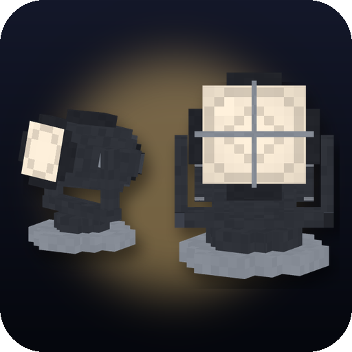

<p align="center">
  
</p>

<h1 align="center">Lumen Rigs</h1>

<p align="center">
  Aimable spotlights, floodlights, searchlights and soft panels with colored light and visible beams.
</p>

<p align="center">
  
  <a href="https://neoforged.net"></a>
  
</p>

## Features

- **Four fixtures**, each on a motorized yoke that turns smoothly to its aim:
  - **Spotlight** — a zoomable stage spot, beam angle 5–45°, reaches 32 blocks.
  - **Floodlight** — a wide LED wash with barn doors, 40–120°, for areas and facades.
  - **Searchlight** — a long tight beam of 2–15° that reaches 64 blocks; sweep the night sky with it.
  - **Soft Light Panel** — a flat panel that softly lights everything in front of it.
- **Mount anywhere** — floor, walls or ceiling; the fixture hangs or stands the right way.
- **Real directional light** — the beam lights exactly the spot it points at, fading towards the edge of the cone and
  with distance; walls cast shadows. It also lights up mobs and players standing in it.
- **Any color** — 16 dye colors, a hue slider or warm white. Colored light tints what it hits, and colors mix like
  light: red and green make yellow.
- **Visible beams** — a cone of lit air, strongest in the dark, plus a lens flare when a fixture points at you.
- **Lighting Remote** — link fixtures and aim them together:
  - use on a fixture to link or unlink it (linked fixtures are outlined while you hold the remote);
  - use on any block to point every linked fixture at that spot;
  - use on a mob or player to make the fixtures follow it;
  - use into the air to shine where you look, e.g. into the sky; sneak-use into the air to forget all links.
- **Settings screen** — right-click a fixture: pan, tilt, beam angle, brightness, color, aim mode (manual, point,
  follow, sweep), sweep width and speed, redstone mode, and "Aim at me". Every change shows instantly.
- **Redstone** — ignore it, turn on or off with a signal, or use the signal strength as a dimmer.

## Controls

| Action | How |
|---|---|
| Open a fixture's settings | *Use* (right click) on it with an empty hand |
| Link / unlink a fixture | *Use* on it with the Lighting Remote |
| Aim linked fixtures at a block | *Use* the remote on the block |
| Follow a mob or player | *Use* the remote on it |
| Shine where you look | *Use* the remote into the air |
| Forget all links | *Sneak* + *Use* the remote into the air |

## Crafting

| Item | Recipe |
|---|---|
| Spotlight | 3 Iron Ingots on top; Iron Ingot, Redstone Lamp, Glass Pane in the middle; Copper Ingot below |
| Floodlight | 3 Iron Ingots on top; 2 Redstone Lamps and a Glass Pane in the middle; Copper Ingot below |
| Searchlight | 3 Iron Ingots on top; 2 Redstone Lamps and Glass in the middle; Iron Block, Copper Ingot, Iron Block below |
| Soft Light Panel (2) | 3 Paper on top; Iron Ingot, Glowstone, Iron Ingot below |
| Lighting Remote | Redstone Torch, Redstone and Iron Ingot in a column |

In creative mode everything is in the **Pocky Mods** tab, the fixtures also in **Functional Blocks** and the remote
in **Tools & Utilities**.

## Configuration

Common config (`config/lumen_rigs-common.toml`, also editable from the in-game mod list):

| Option | Default | |
|---|---|---|
| `remoteRange` | 128 | reach of the Lighting Remote, in blocks |
| `followRange` | 96 | fixtures stop following a target further away than this |

Client config (`config/lumen_rigs-client.toml`):

| Option | Default | |
|---|---|---|
| `beams` | true | draw visible beams |
| `beamStrength` | 1.0 | how visible the beams are |
| `lighting` | true | let fixtures light up blocks and mobs |
| `colorStrength` | 1.0 | how strongly colored light tints what it hits |
| `maxLights` | 48 | how many of the nearest fixtures light up the world at once |

## Compatibility

The light is computed by each player's game, so nothing is placed in the world: it is safe for servers and other
mods, and it does not stop mobs from spawning. It hooks into Minecraft's own block and entity rendering; mods that
replace the chunk renderer (such as Sodium or Embeddium) bypass it — the game keeps working, the fixtures and beams
still show, but blocks are not lit. The game log says which light hooks are active.

## Installation

1. Install [NeoForge](https://neoforged.net) for Minecraft 1.21.1.
2. Put this mod into the `mods` folder.

The mod is needed on both the client and the server.

## Building

```sh
./gradlew build
```

The jar is written to `build/libs/`.

## Credits

- Author: **Pocky**.

<!-- more-mods:start -->
<!-- more-mods:end -->

## License

[MIT](LICENSE)
